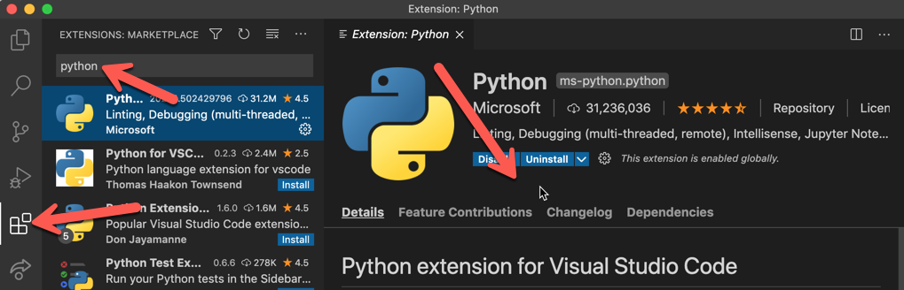

# Your Computer Setup

*Installation Guides*

## Overview

This document is about setup for your computer. Typically this guide is done after the Pi setup guides, but they can be done in any order. If you are looking for the document about setup for your Pi visit [the Pi Installation Guide](Pi_Installation_Guide.md).

## Table of Contents

- [Using the command line on Windows](#using-the-command-line-on-windows)
- [Install Git](#install-git)
- [VS Code (Visual Studio Code)](#vs-code-visual-studio-code)
- [Python3 and Pip](#python3-and-pip)
- [MQTT](#mqtt)
- [PySerial](#pyserial)
- [Git Repo](#git-repo)

## Using the command line on Windows

On a Mac a command line is commonplace (i.e. the Terminal), same with Linux. However, on Windows it's a bit less common. It's still available though. In fact there are like 3+ different programs that can be used as a command line program (which is super annoying). Typically, I recommend using the terminal that is within VS Code using Powershell. I find it works well about 30% to 40% of the time, which makes it your best option (sorry). You can also use **Powershell** directly. To launch Powershell do a search in the Startup Search box for "Powershell", then open the program.

There are a few commands that are different in a Windows environment command line shell, most notably `ls` doesn't work to list the files in some Windows command line tools. You need to use the original Windows `dir` command instead. Some commands like `cd` are the same, but there are other little differences on the two platforms. Just warning you.

## Install Git

Assuming you've taken other programming classes, you probably already have Git on your computer. If you don't think you have Git installed from other classes (uncommon), then you can install it here: https://git-scm.com/downloads (if you do that install, all of the defaults are fine, they ask a ton of questions). If you don't know, feel free to do the download again. Worst case it'll update your version and do no harm.

## VS Code (Visual Studio Code)

For our main text editor / IDE we'll use VS Code. VS Code is nice since it works well for Python, Node, and web development (we'll be doing a little bit of everything). You may already have VS Code installed on your computer. If not visit: https://code.visualstudio.com/download

Go ahead and open VS Code and install some extensions. Click on the Extensions icon (far left icon shown below), then search for an extension, then click Install.



Install the following extensions:

- Python
- Remote Development (by Microsoft)
- ~~Arduino~~ *Deprecated Oct 2024*

Other extensions I recommend that are non critical. They are easy to add:

- Beautify
- Material Icon Theme
- Image preview

Note, if you have additional extensions installed from other classes that's fine.

## Python3 and Pip

Python is a language. Python is also the name of the interpreter that runs your python files. Pip is a package manager tool for Python. We'll use Python in this course as one of our languages (Python installations should contain pip). Make sure you have Python 3 and pip installed (it probably already is). In addition to being installed, we'd also like to use it from the command line. You can see if this works by opening the terminal in VS Code (Ctrl-J I think is the Windows shortcut or you can use the menu). Then within the terminal type

```
python --version
pip --version
```

If it worked it should say some version of Python 3. Potentially you don't have Python, that fix is easy you can visit https://www.python.org/downloads/ to update Python 3. More commonly the problem is that Python isn't on your Environment Variables path. Your Environment Variables PATH is a rather deeply hidden secret. You need to add the path of your Python interpreter. Here is a doc that has some troubleshooting steps *(TODO: add link)*. That doc is focused on Pyserial, but shows the basics you need to edit your Environment Variables. Note, if you edit your Environment Variables, close the terminal in VS Code, and close VS Code, then reopen VS Code and the Terminal for the change to take effect.

**Troubleshooting if `python --version` works but `pip --version` fails.**
You can always use the full pip command:

```
python -m pip --version
```

## MQTT

For Python communication from the Pi to your computer we'll use MQTT. MQTT is one of the most popular IoT communication methods. You'll need to use Pip to install MQTT on your computer and your two Pis (pi400 and the car). It can be installed via…

```
pip install paho-mqtt
```

With pip installations you can run that command from any location.

## PySerial

For Python communication from your computer to an Arduino we'll use PySerial. Serial communication is commonplace in robotics. We've used it a lot in other classes as well. Your Pi already has PySerial installed, here we are installing it for your computer as well. It can be installed via…

```
pip install pyserial
```

With pip installations you can run that command from any location. If you get a permissions error you might try `pip install pyserial --user`

Here is a doc that has some troubleshooting steps *(TODO: add link)*.

**Common:** If you don't have permission to run scripts try this….

```powershell
Set-ExecutionPolicy -Scope Process -ExecutionPolicy Bypass
```

## Git Repo

No surprise we'll use Git in this course. You will create files on your Pi in 2 ways.

1. You will create and type files on your Pi using a monitor (i.e. with connected peripherals). Those files will all go into your git repo folder.
2. Or you will create and type files on your Computer into your git repo folder, then SFTP them to your Pi to run them.

Either way 100% of the code you write in this class will be into your 1 and only Private Git repo. We'll use Github Classroom so that you have a managed Git repo (i.e. it's private, but I can see your code easily to help). Follow these instructions to setup your Git repo for this class.

[Creating and Cloning your Github Classroom git repo](TODO-add-link) *(TODO: add link)*

---

I think that's it for now. The computer setup should've been much shorter than the Pi setup, which is odd because we'll write a lot more code on your computer.
