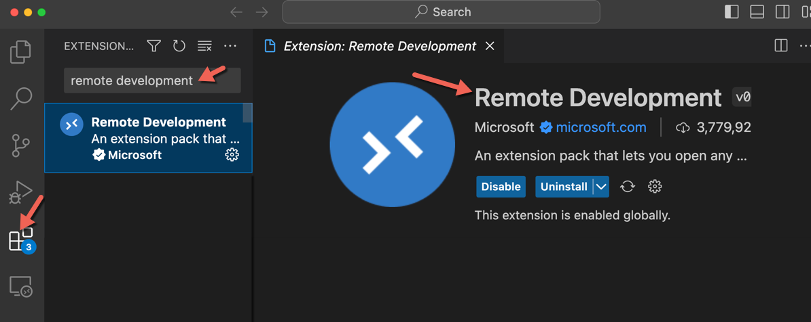
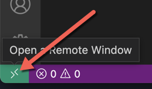
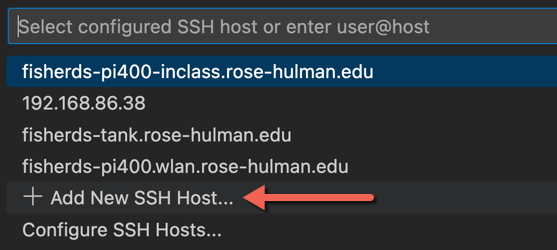
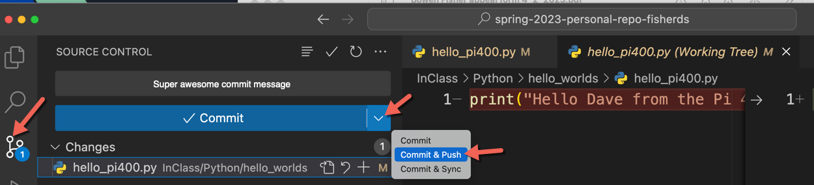

# Your Computer Setup

*Installation Guides*

## Overview

This document is about setup for your computer. Typically this guide is done after the Pi setup guides, but they can be done in any order. If you are looking for the document about setup for your Pi visit [the Pi Installation Guide](Pi_Installation_Guide.md).

## Table of Contents

- [Using the command line on Windows](#using-the-command-line-on-windows)
- [Set up GitHub](#set-up-github)
- [VS Code (Visual Studio Code)](#vs-code-visual-studio-code)
- [Python3 and Pip](#python3-and-pip)
- [MQTT](#mqtt)
- [PySerial](#pyserial)
- [Git Repo](#git-repo)
- [Remote Development](#remote-development)

## Using the command line on Windows

On a Mac a command line is commonplace (i.e. the Terminal), same with Linux. However, on Windows it's a bit less common. It's still available though. In fact there are like 3+ different programs that can be used as a command line program (which is super annoying). Typically, I recommend using the terminal that is within VS Code using Powershell. I find it works well about 30% to 40% of the time, which makes it your best option (sorry). You can also use **Powershell** directly. To launch Powershell do a search in the Startup Search box for "Powershell", then open the program.

There are a few commands that are different in a Windows environment command line shell, most notably `ls` doesn't work to list the files in some Windows command line tools. You need to use the original Windows `dir` command instead. Some commands like `cd` are the same, but there are other little differences on the two platforms. Just warning you.

## Set up GitHub

You'll need a free GitHub account and GitHub Desktop, the GUI we'll use for git in this course (no command line git required, though feel free if you're comfortable with it).

- Make a GitHub account (if you don't already have one): https://github.com/. If you're making a new account, use this username format: `rhit-USERNAME` (where USERNAME is your Rose-Hulman username) — for example, Dr. Fisher's is `rhit-fisherds`.
- Install GitHub Desktop: https://desktop.github.com/

Once those are ready, make your repos on github.com (click the **+** in the upper right → **New repository**). Make both of these **Private**:

- **Individual repo** — just for you. Suggested name: `me435-personal-repo-USERNAME` (replace USERNAME with your Rose-Hulman username).
- **Team repo** — only **one** person on your team needs to create this one. Suggested name: `me435-team-repo-USERNAME-USERNAME` (both teammates' usernames).
  - Invite your partner as a collaborator: on the team repo, go to **Settings** → **Collaborators** → **Add people**, then search for their GitHub username or email and send the invite. Your partner will get an email (and a notification on github.com) — they need to click **Accept invitation** there before they can see, clone, or push to the repo.

Clone both repos to your computer with GitHub Desktop: **File → Clone Repository…**, pick each repo from the list (or paste its URL), and choose a folder on your computer.

## VS Code (Visual Studio Code)

For our main text editor / IDE we'll use VS Code. VS Code is nice since it works well for Python, Node, and web development (we'll be doing a little bit of everything). You may already have VS Code installed on your computer. If not visit: https://code.visualstudio.com/download

Go ahead and open VS Code and install some extensions. Click on the Extensions icon (far left icon shown below), then search for an extension, then click Install.


Install the following extensions:

- Python
- Remote Development (by Microsoft)
- Arduino Community Edition (the original "Arduino" extension was deprecated Oct 2024 — this community fork replaces it)

### Arduino Community Edition setup

The Arduino Community Edition extension uses the Arduino CLI under the hood. It's usually bundled with the extension and should "just work." If you have trouble (pretty common), open your Settings (File → Preferences → Settings, or Code → Settings on Mac) and search for `Arduino: Use`.

- Set **Use Arduino Cli** to true (try a restart). If it's still broken, try setting the Arduino CLI **Path** and **Command Path**. On Windows that will probably be:

```
"arduino.useArduinoCli": true,
"arduino.path": "C:\\arduino-cli",
"arduino.commandPath": "arduino-cli.exe"
```

- If you're not sure where the Arduino CLI actually lives on your machine, open a terminal and run `where arduino-cli` (Command Prompt) or `Get-Command arduino-cli` (PowerShell). That'll show you the real path — take the folder part (everything except `arduino-cli.exe` at the end) and use it as `arduino.path`.
- If you still can't get it working, that's fine — just use the Arduino IDE 2 instead.

**Optional: make auto-format look nicer.** By default C/C++ auto-format in VS Code uses a "Visual Studio" style. To switch to a more compact style:

1. Within VS Code go to File → Preferences → Settings (Code → Settings on Mac)
2. Search for `C_Cpp.clang_format_fallbackStyle`
3. Change the value from `Visual Studio` to: `{ BasedOnStyle: Google, IndentWidth: 2, ColumnLimit: 0}`
4. Next time you auto-format (Alt-Shift-F on Windows) it'll use this style instead.

If you skip this step it's totally fine — it's just a style preference.

## Python3 and Pip

Python is a language. Python is also the name of the interpreter that runs your python files. Pip is a package manager tool for Python. We'll use Python in this course as one of our languages (Python installations should contain pip). Make sure you have Python 3 and pip installed (it probably already is). In addition to being installed, we'd also like to use it from the command line. You can see if this works by opening the terminal in VS Code (Ctrl-J I think is the Windows shortcut or you can use the menu). Then within the terminal type

```
python --version
pip --version
```

If it worked it should say some version of Python 3. Potentially you don't have Python, that fix is easy you can visit https://www.python.org/downloads/ to update Python 3. More commonly the problem is that Python isn't on your Environment Variables path. Your Environment Variables PATH is a rather deeply hidden secret. You need to add the path of your Python interpreter. Here is a doc that has some troubleshooting steps *(TODO: add link)*. That doc is focused on Pyserial, but shows the basics you need to edit your Environment Variables. Note, if you edit your Environment Variables, close the terminal in VS Code, and close VS Code, then reopen VS Code and the Terminal for the change to take effect.

**Troubleshooting if `python --version` works but `pip --version` fails.**
You can always use the full pip command:

```
python -m pip --version
```

### Create a virtual environment

Rather than installing packages globally on your computer, we'll use a **virtual environment** (venv) for this course's repo — it keeps this course's packages separate from anything else on your computer.

Open your repo folder in VS Code, then use the Python extension to create one:

1. Open the Command Palette (`Ctrl-Shift-P`) and run **Python: Create Environment…**
2. Choose **Venv**, then pick your Python 3 interpreter.
3. VS Code creates a `.venv` folder in your repo and automatically activates it in any new integrated terminal you open in that workspace (you'll see `(.venv)` at the start of your prompt).

**Common (Windows):** if activating the venv fails with a message about running scripts being disabled, run this once in that terminal:

```powershell
Set-ExecutionPolicy -Scope Process -ExecutionPolicy Bypass
```

With the venv active, install the packages below — they'll go into the venv instead of your global Python.

## MQTT

For Python communication from the Pi to your computer we'll use MQTT. MQTT is one of the most popular IoT communication methods. You'll need to install MQTT on your computer (into your virtual environment) and your three Pis (pi400, car, and Pi 5). It can be installed via…

```
pip install paho-mqtt
```

## PySerial

For Python communication from your computer to an Arduino we'll use PySerial. Serial communication is commonplace in robotics. We've used it a lot in other classes as well. Your Pi already has PySerial installed, here we are installing it for your computer as well (into your virtual environment). It can be installed via…

```
pip install pyserial
```

Here is a doc that has some troubleshooting steps *(TODO: add link)*.

## Git Repo

No surprise we'll use Git in this course. You will create files on your Pi in 2 ways.

1. You will create and type files on your Pi using a monitor (i.e. with connected peripherals). Those files will all go into your git repo folder.
2. Or you will create and type files on your Computer into your git repo folder, and use VS Code's **Remote Development** extension to edit and run them directly on your Pi.

Either way, 100% of the code you write in this class goes into your Git repos, both made from scratch on github.com (Private):

- Your **individual** repo — 1 per person, just for you.
- Your **team** repo — 1 per team, invite your partner as a collaborator.

Clone both repos to your computer with GitHub Desktop. To get them onto your Pi, we'll use VS Code's Remote Development extension to connect to your Pi and clone/pull/push from there — since it forwards your computer's GitHub credentials, you won't need to sign into GitHub separately on the Pi. More on that in the Remote Development guide.

## Remote Development

Once your Pi is set up (from the [Pi Installation Guide](Pi_Installation_Guide.md)) and connects to RHIT-OPEN automatically as a non-guest, you can leave the monitor/keyboard/mouse behind and control it entirely from VS Code on your computer using the **Remote Development** extension pack (installed above). This is "headless mode."



### Checking SSH to your Pi

Before using Remote Development, confirm you can SSH into your Pi. From a terminal on your computer:

```
ssh pi@hostname.rose-hulman.edu
```

For example:

```
ssh pi@fisherds-pi400.rose-hulman.edu
```

The first time you connect to a given Pi, you'll be asked to trust the host — type `yes` and hit enter (this only happens once per Pi). Then type the password (`C$$E435`, no characters will show as you type — that's normal for Linux). If it worked, your command prompt will change to show you're now on the Pi (e.g. `pi@fisherds-pi400:~ $`).

If you can't connect:

- Make sure your Pi has actually finished EIT registration (see [EIT Registration](#eit-registration-new-devices-only) in the Pi guide) — guests can't use SSH.
- Double check the hostname you set when you imaged the SD card.
- If the hostname trick isn't working (or you're on a network other than RHIT-OPEN, like at home), SSH to the Pi's IP address instead — get it from the Pi with `ifconfig`, then `ssh pi@<ip-address>`.

### Connecting with Remote Development

- Click the Remote button in the lower-left corner of VS Code, then **Connect to Host…**



- If you don't see your Pi in the list, click **Add New SSH Host…** and type `pi@hostname.rose-hulman.edu` (same format as the SSH test above).



- The first time you add a host this way, VS Code adds it without connecting — look for a follow-up popup and click **Connect**. After that, you can just pick it from the list.
- Remote Development will download the VS Code Server onto your Pi (first time only). Once it's connected you'll have a terminal into your Pi, but no folder open yet — next you'll clone your repo.

### Cloning your repo on the Pi

The VS Code window that just opened is actually running on your Pi now (check the green box in the bottom-left corner — it'll show the Pi's hostname).

- Copy the HTTPS clone URL for your repo from github.com (the green **Code** button).
- In the VS Code window that's on the Pi, hit `Ctrl-Shift-P` to open the command palette, type **Git: Clone**, paste the URL, and hit enter.
- Follow any sign-in prompts if asked — since Remote Development tunnels through your computer, it can reuse your computer's GitHub credentials, so you shouldn't need to set up a separate login on the Pi.
- When it finishes, click **Open** to open the cloned folder.

Do this once for your individual repo, and again for your team repo, on each Pi you plan to use headlessly.

### Set your git name and email (once per Pi)

Before you can commit from the Pi, git needs to know who you are — **this is the single most important step in this whole doc**, so don't skip it. In the terminal of the VS Code window that's running on your Pi:

```
git config --local user.name "FIRST_NAME LAST_NAME"
git config --local user.email "MY_NAME@example.com"
git config pull.rebase false
```

For example:

```
git config --local user.name "Dave Fisher"
git config --local user.email "fisherds@rose-hulman.edu"
git config pull.rebase false
```

There's no confirmation message — if there are no errors, it worked. Do this in each repo folder (individual and team) on each Pi.

### Commit and push from the Pi

Make a small edit or new file, then use the Source Control tab to commit (**Commit & Push**, or commit then hit the sync button).



Then, back on your computer, pull/sync to confirm you see the change that came from the Pi.

### Troubleshooting: divergent branches

If a git pull on the Pi ever fails with something like: hint: You have divergent branches and need to specify how to reconcile them. it just means git needs to know your merge strategy. Run:

```
git config pull.rebase false
```

then try the pull/sync again.
