# Raspberry Pi Installation Guide

## Overview

In general I dislike installations. I don't find them fun. They are simply **entirely necessary** to do cool things. In this class, however, I think of the installations as PART OF what we are learning. There are many things that need to be done to setup your Raspberry Pi. This document is all about installations on your Pi 400, your car's Pi, and your Pi5.

| Raspberry Pi 400 | Raspberry Pi 4b on the Freenove Car | Raspberry Pi 5 |
| --- | --- | --- |
| 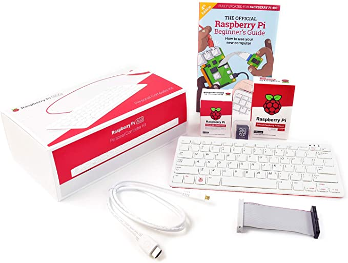 | 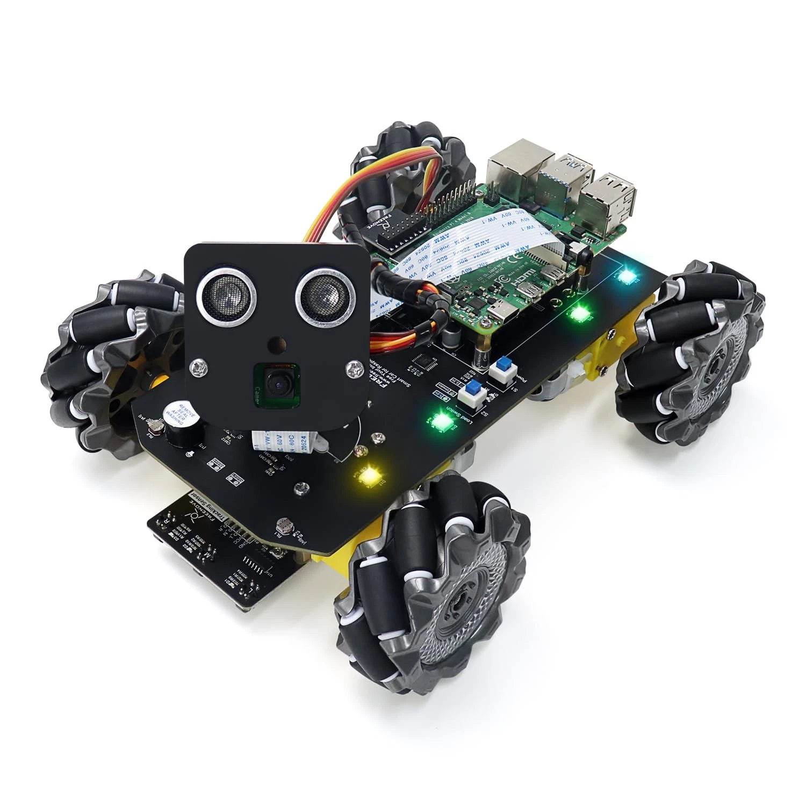 | 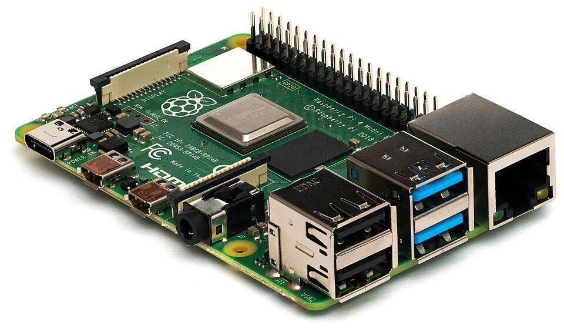 |
| The Raspberry Pi inside a keyboard | Raspberry 4 Model B for your rover | Latest Raspberry Pi in a black case |

If you are trying to find installations for your computer see the [Computer Installation Guide](Computer_Installation_Guide.md).

Note: a lot of this material overlaps with the official [Raspberry Pi Getting Started guide](https://www.raspberrypi.com/documentation/computers/getting-started.html), which is worth a look too.

### Disclaimer

Your Pi 400 will sometimes have peripherals connected, a keyboard, monitor, and mouse. However, usually a Pi typically NOT have peripherals connected. It will typically operate in headless mode, i.e. no monitor, no keyboard, no mouse. You will use tools like SSH and the VS Code plugin called **Remote Development**. However, for parts of this setup peripherals can be useful. While peripherals are helpful for setup, once each Pi auto connects to the network and you know the IP address or name, then everything will be remote (i.e. headless mode with no peripherals).

Your car's Pi looks like a normal Raspberry Pi hidden within the car.


It's annoying (but still possible) to connect a monitor, keyboard, and mouse to the Pi in a built car.

So you will perform all the steps in this document three times: once for your Pi 400, once for your car's Pi 4b, and once for the Pi 5. I recommend you do the setup for the Pi 400 first, but you can start with whichever you prefer.

FYI before you start: if you are on campus you will connect all of your Pis (yes, Pis is the plural of Pi, not Pies) to **RHIT-OPEN**, not eduroam.

## Table of Contents

- [Image your micro SD cards](#image-your-micro-sd-cards)
- [Connect your peripherals](#connect-your-peripherals)
- [Setup Wizard](#setup-wizard)
- [Change the password](#change-the-password-probably-done-in-the-setup-wizard)
- [Change the hostname](#change-the-hostname-not-done-in-the-setup-wizard)
- [Enable SSH](#enable-ssh-not-done-in-the-setup-wizard-so-do-it-now)
- [Enable Serial Port](#enable-serial-port-not-done-in-the-setup-wizard-so-do-it-now)
- [Enable I2C for Servos (Car Pi only!)](#enable-i2c-for-servos-car-pi-only)
- [Localisation settings](#localisation-settings-probably-done-in-the-setup-wizard)
- [Network Connection](#network-connection-probably-done-in-the-setup-wizard-just-need-to-open-this-doc-on-your-pi)
- [EIT Registration](#eit-registration-probably-new-devices-only)
- [Software - Programs](#software---programs)
- [Install Python 3 and pip](#install-python-3-and-pip-should-be-pre-installed-just-checking)
- [MQTT](#mqtt-not-preinstalled---can-do-this-later-if-you-want)
- [gpiozero for Python](#gpiozero-for-python-already-installed-just-an-fyi)
- [SSH - Check](#ssh---check-the-last-important-thing)
- [Next Steps](#next-steps)

## Image your micro SD cards

The prior owner of your equipment probably put an OS on the micro SD card, but you will start from a clean slate and use the latest Raspberry Pi OS. So first, you need to pull out the micro SD card and put a new Raspberry Pi image on that micro SD card. So this step will happen on your computer with just the micro SD card. The micro SD card is the hard drive of the Pi. It's handy that you can unplug the Pi hard drive with ease. Find your micro SD cards. The Pi 400 is probably in the Pi 400, the car micro SD card is in the car, and the Pi 5 micro SD card is probably in the Pi 5. Find all of your micro SD cards and find the **micro**-SD card to normal-sized-SD card adapter.

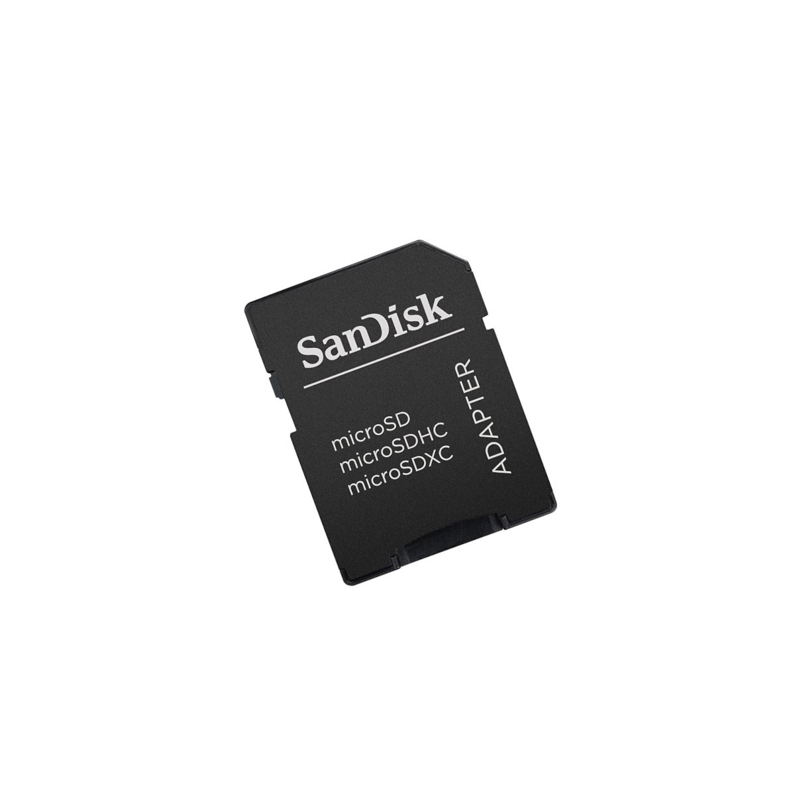

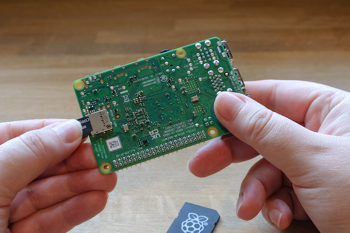

- On your normal computer, download and install the Raspberry Pi Imager: https://www.raspberrypi.com/software/
- Next insert a Micro SD card into your computer (probably via a micro SD card adapter)
  - Hopefully your computer has an SD card slot, if not, you will need a USB SD card reader. Dr. Fisher will purchase 1 that you can borrow if needed, so far that hasn't been an issue for student laptops.
- Open the Raspberry Pi imager, choose the Pi type that you plan to put this SD card into, the Recommended OS for that device, and the SD card (which should show up in the options if it does not, then you need to unplug and replug the SD card or restart your computer and try again). Then click the button (Write or Next) to **write** it.
- I do NOT bother copying configurations from my computer. Just click No.

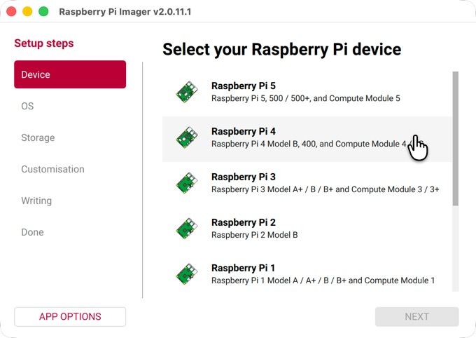

- It's like a 1.2 gig download (sorry about your quota limits).
- Once complete, remove the micro SD card from your computer and insert it into your Raspberry Pi 400 (or car Pi depending on which pass through this document you are doing).
  - Pi 400 - The label is up, the pins are down, the metal pins on the micro SD card are on the bottom
  - car Pi - The label is down, the pins are up, the metal pins on the micro SD card touch the printed circuit board. (note, "up" is normal Raspberry Pi board "up" if it wasn't in a car)
  - Connect your peripherals before you power on the Pi.

## Connect your peripherals

A Raspberry Pi is a computer. It is slower than your computer. It's a 32 bit system (at the time this document was written). And it costs like $60-$80 bucks instead of $1500+. Like any computer, you typically want peripherals (keyboard, mouse, monitor) to use the computer. When we use the car in headless mode, we'll drop all the peripherals and use the Pi in remote development mode. However, for this setup we DO want peripherals. Connections:

- Typically, I connect all of my peripherals then turn on power last
- Connect a monitor to your Pi using your mini HDMI cable. We provide a tiny 9" monitor that you can use, but if you have any external monitor with an HDMI plugin use that instead! The tiny 9" monitor we provide is a pain, but we can't assume you own a big external monitor and we didn't want to spend lots of money.
  - Technically, the HDMI port on the Pi should provide power to power the 9" monitor, but that is only reliable sometimes and it's usually necessary to plug it in before anything is turned on. If it fails to power the monitor, plan to power the 9" monitor via the DC mini-USB plug. You should be able to use a USB on the Pi or a powered USB connection on your computer or wall USB plug. Note, the monitor will not be a touch screen in this case, but that's ok.
- Note: You can also use a TV as your monitor if it has an HDMI plug.
- Connect a mouse to your Pi
- If needed connect a keyboard to your Pi (obviously not needed for the Pi 400, only the car Pi).
- Connect power to your Pi (Note: for the car, use wall power for now, not the batteries)
  - Usually I use the PiSwitch (find that in your kit) and have it plugged in, but off initially. Using the PiSwitch cable is optional. I just added those since it feels more elegant to turn off your computer that way vs unplugging it.
- Power things on and hope you see a screen pop up on the monitor.
  - This step can be the most frustrating as it's easy for something to go wrong and you'll just stare at a black screen. That happens to everyone. We will help you fix it! Usually the Pi 400 just works and the car has issues, but you never know.
- Once you have a screen displaying, start in on the setup steps.

## Setup Wizard

The OS should have a setup wizard pop up to help you with some of the typical setup steps. That's great! Answer questions as appropriate in the setup wizard tool. The setup wizard might have you do things like:

- *Change the username*: super do that! See the password step below for what you should make the username: `pi` (recommended not required. Note: this is the default username. I think it's fine to use the default username if the password is not the default password, but you'll get a nasty warning message about using the default username. Fine.)
- *Change the password*: super do that! See the password step below for what you should make the password: `C$$E435` (recommended not required)
- *Set your Localizations*: super do that! See the localization step below for details if you need them, basic stuff US, Eastern, etc. I select New York if asked for a time-zone. I'm sure Indianapolis works fine too, but in the old days Raspberry Pi didn't realize we started doing daylight savings time (ugh).
- *Setup your Wifi*: Awesome! Use **RHIT-OPEN** if on campus
- *Install updates*: do that (warning it takes a **long** time, don't start if within 20 minutes of leaving time)
- *Set your hostname* (*uncommon, probably won't ask*): if it asks you to set a hostname within the wizard, then great! See the hostname step below for the name to use names:
  - *username*-pi400
  - *username*-car
  - *username*-pi5

However, we'll talk about the process for each step as if no magic setup wizard launched for you. (It happens due to monitor issues)

## Change the password (probably DONE in the setup wizard)

In the old days, the default user on a Pi is named `pi` and the default password for the user named `pi` is `raspberry`. Every Raspberry Pi used this configuration out of the box and like half the people didn't know that you should change it (at least change the password).

- username: `pi` ← Personally I DO use this same default username
- password: ~~`raspberry`~~ ← Do **NOT** make this your password!

All hackers know that the default password for a Raspberry Pi is the word `raspberry`. Once EIT registers a MAC address, that Raspberry Pi is no longer in Guest mode and has network privileges (discussed in a later step). Therefore, it is required that you change your password. Interestingly, it's ok if we all use the same password. I asked EIT and they said our real concern is outside attacks. So your Pi's login info could all be the same and all of us can know it (that is not a requirement, but is ok), but it can't be the default that the **whole world knows**. So I keep the username set to `pi`, but make our password: `C$$E435` (even if you are in ME435). That is a secure password and it's easy if we all use the same one for the Pi 400 and the car Pi for troubleshooting help. It's also fine since the outside world doesn't know the password and people within the class can be trusted to only help you (right?). You probably got asked to change your password already in the setup wizard, **if you did not see a setup wizard to set your password**, you can change your password via the Menu → Preferences → Raspberry Pi Configuration (easiest) or via the command line. If you use the Raspberry Pi Configuration program, go to the **System** tab and just click the "**Change Password…**" button and follow the steps. If for any reason that program won't open (or you are using SSH or something), then use the command line, following these steps.

- Open a Terminal window on the Pi to use the command line and type:
- `passwd`
  - Current password: `raspberry` (this is the default password)
  - New password: `C$$E435`

Details: https://www.raspberrypi.com/documentation/computers/configuration.html#users

Do this for any Pi you use in this course (Pi 400, car, and Pi 5). It is an important step to EIT, so it needs to be an important step for you as well.

## Change the hostname (NOT done in the setup wizard)

Your setup wizard might not have had you set your hostname for your computer. This allows you to use a name instead of an IP address when accessing your Pi on the Rose network from your computer. You can make this change via menu → Preferences → Raspberry Pi Configuration (easiest) or via the command line.

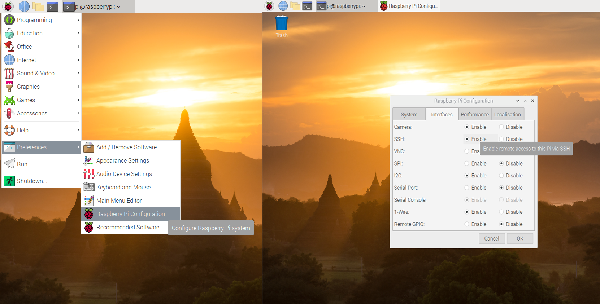

Use this format for your Raspberry Pi computer hostnames:

- *username*-pi400
- *username*-car
- *username*-pi5

For example my Pi 400 is **fisherds-pi400**

BTW the next few steps all use this Pi Configuration app (menu → Preferences → Raspberry Pi Configuration). Set them all, then you will be asked to reboot. It's nice to reboot only once at the end of configuration.

Note, if you can't find that program you can also use the command line. Details for the command line option (if using SSH or can't use the Pi Configuration app) can be found here: https://www.tecmint.com/set-hostname-permanently-in-linux/

In short this command if using that approach:

```
sudo hostnamectl set-hostname NEW_HOSTNAME
```

You can check that it worked (regardless of which method you used to set it) by typing:

```
hostname
```

into a Terminal window. BTW when I say to type a command line, that is done via a command line Terminal. You can open a Terminal via this icon:

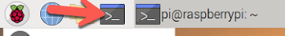

Note: You will type MANY commands into the command line during this setup and throughout this course. You WILL become comfortable with using the command line on a computer during this class if you are not already.

## Enable SSH (NOT done in the setup wizard, so do it now)

For security reasons SSH is disabled by default, but we need that for easy communication (especially for the car). Again this is easiest to set in the Raspberry Pi Configuration tool (menu → Preferences → Raspberry Pi Configuration). Go to the **Interfaces** tab and **enable** in the **SSH** row. (Note, the image below looks different now, no biggy).


If for some reason you can't launch the newest Config tool, you can use this old Config tool from the command line: `sudo raspi-config` For more instructions on the command line approach, visit: https://www.raspberrypi.com/documentation/remote-access/ssh/

## Enable Serial Port (NOT done in the setup wizard, so do it now)

In the same menu as the SSH enable there is a **Serial Port** Enable. Turn that one on as well. Again this is easiest to set in the Raspberry Pi Configuration tool (menu → Preferences → Raspberry Pi Configuration). Go to the **Interfaces** tab and select enable the Serial Port row.

## Enable I2C for Servos (Car Pi only!)

(car Pi only) For the servos that are on the car we'll use an external servo driver chip. We'll need to enable I2C on the car so that we can use that chip.

## Localisation settings (probably DONE in the setup wizard)

If you have not already done this via a setup wizard, go set your Localisation options. Just quickly run through all four buttons in the Menu > Preferences > Raspberry Pi Configuration, Localisation tab.

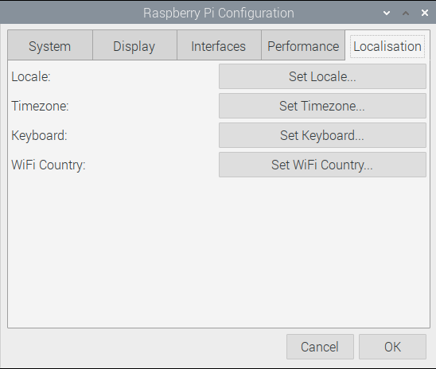

Just make sure you are all set for the US. Note, for my **Set Timezone...** option I picked America > **New York** instead of Indianapolis since Indiana isn't weird anymore.

**Optional extra related to time:**

When you have a monitor connected to the Pi, the clock you see in the upper right uses a 24-hour display format (example 13:59). Personally, I prefer a 12-hour display format (example 1:59 pm). If you care, here is how you fix it (or you can skip this if you don't care since you'll rarely use a monitor with the Pi). To fix it, right click on the time and select **Digital Clock Settings**, then you'll see the current Clock Format is `%R`. Based on this website *(TODO: add link)* you can set the format to instead be: `%l:%M %p`

To clarify, that first letter is a lowercase L. However, a capital I also works, it just has a leading 0. From the docs to explain….

- When using **capital I** as in India, `%I` is replaced by the hour (12-hour clock) as a decimal number (**01-12**).
- When using **lowercase l** as in Lima, `%l` is replaced by the hour (12-hour clock) as a decimal number (**1-12**); **single digits are preceded by a blank.**

## Network Connection (probably DONE in the setup wizard, just need to open this doc on your Pi)

If you have not already done so, connect your Pi to the internet. If you are on campus and have a good WiFi signal connect to RHIT-OPEN (if your WiFi signal is bad use an ethernet cable, uncommon). Assuming you are using WiFi, look for the networking icon in the upper right (two arrows), click it, and follow the steps to turn on WiFi and connect to RHIT-OPEN. Once complete visit https://www.rose-hulman.edu/ from Chromium.


Note, since a Pi is a 32 bit computer it uses Chromium instead of Chrome. Chrome is a 64 bit only program, but Chromium is the lightweight alternative that can come in a 32 bit package.

Now it's time for a test. When you visit this page https://www.rose-hulman.edu/ on your Pi, I would expect that on a Pi 400 that you borrowed from us, it will just load and display the page as expected without asking for an email. If that is the case you don't need to do the EIT registration step. However, if this is the first time **this Pi** has joined RHIT-OPEN (or EIT dropped all of our mac address again) the https://www.rose-hulman.edu/ internet page won't load. It will instead ask you for a Guest account email address. Using a guest mode on RHIT-OPEN will be fine for this setup, but it WILL NOT work for everything we want to do in this class (for example SSH connections or web servers or VS Code's Remote Developer tools). You can confirm your internet connection works by opening this document on your Pi. Having this document open on your Pi, not just on your computer, will be handy later in this step and in other steps where you need to click a link. To open this document on your Pi, within Chromium type on your Pi…

**https://tinyurl.com/ME435RPi**

Then find this page. Are you now seeing this from your Pi now? Read from your computer if your computer monitor is bigger, but keep this page open on your Pi. Or use an external **HDMI** monitor with the Pi (works much better than the tiny monitors). BTW did you notice how long it took this doc to load on your Pi? A Pi is 1/50th the cost of your computer, so no surprise it's slower to load things.

## EIT Registration (probably NEW devices only)

If you have a new device, then you are now in Guest mode on RHIT-OPEN on your Pi. Guest mode is super annoying, you can't use SSH. If your Pi is in Guest mode that means you need to follow these instructions.

Again: You cannot use communication between your computer which is on eduroam and your Pi if it is in Guest mode on RHIT-OPEN. You must become a **non**-Guest on RHIT-OPEN with your Pi. Guests have very limited rights, non-guests have more network rights (which we need). To become a non-guest, Dr. Fisher needs to send your Mac address to EIT. You can tell me your Mac address on this spreadsheet (click the link below from your Pi):

[Tell me your Mac Address Spreadsheet](TODO-add-link) *(TODO: add link)*

Each Pi has a **wired** Mac address (when used with an ethernet cable, uncommon) and a **wireless** Mac address (when used with WiFi 99.999% of the time). If you only ever plan to use **wireless**, then technically you only need the **wireless** Mac address. However, it's better to be prepared and submit both, just in case you have poor WiFi signal someday and need to use an old school ethernet cable. You need to get those 2 Mac Addresses and submit them to the spreadsheet link above. To do that, from your Pi, type:

```
ifconfig
```

The example output of the `ifconfig` command is shown below. It highlights where you'll find the Mac address values that you care about.

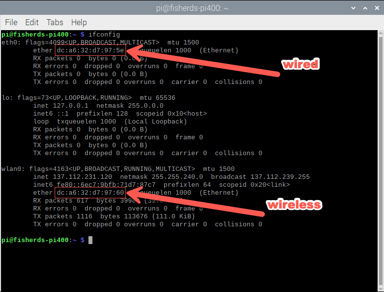

Your **wired** Mac address shows up in the `eth0` (Ethernet) area as the `ether` property. As you can see a MAC address has a very distinct format, for example: `dc:a6:32:d7:97:5e` You need to get that value into the spreadsheet. You can just type it (be careful if you do that). Or you can open the spreadsheet on your Pi and copy/paste the value (be careful with that too since copy/paste is weird from a terminal window). Note: Ctrl-C/Ctrl-V pretty much never work from the Pi command line, so highlight what you want with your mouse and right click to Copy. You can also try to use Shift-Ctrl-C / Shift-Ctrl-V which is supposed to work from the terminal (and "usually" does work). Then right click to paste your Mac addresses into the spreadsheet (one at a time). Then look at the value to be sure it did it right! Note: in future years, students shouldn't need to do this, but EIT seems to drop our Mac addresses periodically.

### Checking if your Pi is out of Guest mode (skip, not useful)

After you submit your Mac address to the spreadsheet, it might take a few days before Dr. Fisher submits them to EIT and it might take EIT a few days to register it, so be patient (sorry). In a few days you can test if it worked using the `nslookup` of your Pi's IP address. For example, if I did `nslookup 137.112.231.120` and it said `fisherds.rose-hulman.edu` (with **guest** in the response) then it is in guest mode, but if it says `fisherds.rose-hulman.edu` (with **wlan** in the response) then you are a non-guest and all set. In order to use the `nslookup` command yourself, you need to use your Pi and you have to install dns utils using this command:

```
sudo apt-get install dnsutils -y
```

After that installation you can find your Pi's IP address (for example `137.112.231.120`) and run `nslookup` on your Pi from the Pi itself. If you see the word **guest** it's in guest mode (that's bad), if you see the word **wlan** you are all set (non-Guest)!

Note, you can still finish all of these installations in Guest mode, so just keep working. You DO need to be out of Guest mode to use SSH later in the course.

> **An important warning about Guest mode…**
> While you are in Guest mode you need to open a browser window to put in an email address **each time you reboot the Pi**. You will not be online until you open a browser window and put in that email.

## Software - Programs

The main program we'll use from the Pi is the Terminal program. BTW when I say to type a command line, that is done via a command line Terminal. You can open a Terminal via this icon:


Open a Terminal (command line console prompt) for the steps below.

### Terminal Preferences (for the tiny monitors)

**Important Pro tip:** On your Pi, if you are using the tiny monitor, you can change the background color and font size of the Terminal window. Go into Edit → Preferences. In that area you can click the Background color to set the color to white, and you can change the font size to be like 20 Bold.

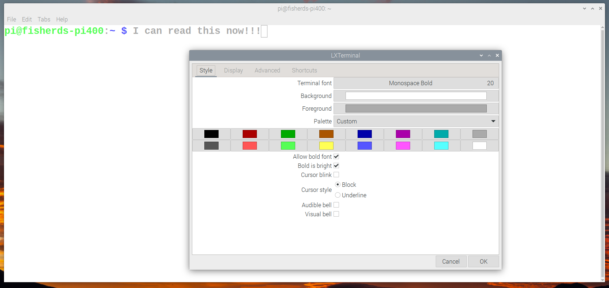

I find when I'm using the tiny monitors that a large font on white background is much easier to see than the tiny text on a black background.

### Updating (probably DONE in the setup wizard)

Before we get started it's nice to do an update. I know your system is "new" and you may have just done this in the setup wizard too, but I want you to do it again anyway. It's always nice to run these commands:

```
sudo apt update
sudo apt full-upgrade
```

Note: you can also combine them to be a single line if you would like. I use this command:

```
sudo apt update && sudo apt full-upgrade -y
```

Pro tip: On your Pi, you can Ctrl-C from here (via Chromium) to copy, then Ctrl-Shift-V into the command line to paste. Not sure the history of why the command line needs the Shift in there (Ctrl-**Shift**-V), but it's necessary and pasting works fine if you add the Shift key. Try it with the line above.

In general you want to run those commands before you install anything (certainly before anything that uses an `apt-get install` command). So before you install something, ask yourself "When did I last run apt upgrade?" Staying up to date is good. I run it before I do an apt-get install (see later commands) plus about once a month.

Reference: https://www.raspberrypi.com/documentation/raspbian/updating.md

BTW the `-y` flag at the end of that command just automatically answers a question "yes" that you would normally be asked when running that command. It's an "Are you sure?" question. I just add the `-y` so that it doesn't bother to ask (automatically answer any silly questions with a yes) *(TODO: add link)*.

### Terminal Shortcuts

When using the terminal there are a few commands you should know. Here is a short list. There is nothing you have to do here, but maybe you should try a few of them to become more comfortable with the command line.

| Command | Description |
| --- | --- |
| `ls` | lists the files in the current folder |
| `ls -lah` | lists the files and hidden files in the current folder in a different format |
| `cd some_existing_directory_name` | change directory |
| `cd ..` | go up one folder level |
| `cd ~` | change directory to the base user folder |
| `pwd` | Displays your current folder location (path to the working directory) |
| `mkdir some_new_folder_name` | Make directory |
| `history` | Display all the commands you've typed |
| `history 10` | Display just the last commands |
| Up arrow key | Retype the last command (this one is surprisingly useful) |
| Tab key | The most useful command ever is the tab key. Tab is "autocomplete". For example if you wanted to `cd some_existing_directory_name` then all you really need to do is type `cd som` then hit the tab key and it will automatically type the rest. |
| `clear` | Clears the prior junk out of your way |

Try a few of those.

```
ls
ls -lah
ls
cd Documents/
ls
mkdir testing
cd testing/
pwd
ls
cd ..
history 10
clear
```

There are also some more advanced helpful shortcuts

| Shortcut | Description |
| --- | --- |
| `Ctrl-k` | Kills all the stuff you've typed from the cursor to the end of the line |
| `Ctrl-r` | Search through old commands you've typed to quickly type one again |
| `Ctrl-a` | Jump the cursor position to the beginning of the line you are typing |

I also want to use this as a time to explain the word `sudo` or Super User DO. You might have noticed it in commands earlier. Sudo means to run the command as the administrator account on the computer instead of the User account. In general sudo gives you more power. Just to try it out, try this command….

```
sudo reboot
```

It reboots the Pi. The `sudo` word means the commands you type have more rights. It is as if they are run by someone important instead of you. :)

## Install Python 3 and pip (should be pre-installed, just checking)

Python is a language. Python is also the name of the interpreter that runs your python files. Pip is a package manager tool for Python. We'll use Python in this course as one of our languages (Python installations contain pip). The current version of the Raspbian now ships with Python 3 as the default version of python. Confirm this by typing:

```
python --version
```

Python 3 is the default. If your version says anything about Python 2 see the old installation guide here: [Old Python 3 instructions](TODO-add-link) *(TODO: add link)*

Next let's check on pip. Same game.

```
pip --version
```

Again it should say in the output log the word (python 3) somewhere in the output line, if not see the old instructions link above. This step used to be hard, but now Python 3 is the default so you don't need to do anything.

If you don't have python 3 and pip 3 on your Pi let me know, but it should be pre-installed with the OS.

## MQTT (not preinstalled) - can do this later if you want

For Python communication from the Pi to your computer we'll use MQTT. MQTT is one of the most popular IoT communication methods. You'll need to use Pip to install MQTT on your computer and your three Pis (pi400, car, and Pi 5). It can be installed via…

Old way (~~don't do this!~~):

```
pip install paho-mqtt
```

New Way (do this!):

```
sudo apt install python3-paho-mqtt
```

(if you are curious about the reason why it changed read this) *(TODO: add link)*

## gpiozero for Python (already installed, just an fyi)

We'll use the GPIO framework called gpiozero with Python. Note, gpiozero is newer and replaces the older Python framework that was called RPi.GPIO. It is already installed by default. I'm just including it here as a reference. Here are some links if you want to learn about gpiozero that you might need later in the course:

- Docs: https://gpiozero.readthedocs.io/en/stable/
- Github page: https://github.com/gpiozero/gpiozero
- Pip page: https://pypi.org/project/gpiozero/

BTW if you prefer to use the older RPi.GPIO it still works. It used a more Arduino-like, traditional syntax. Here are some links to that one:

- Docs / Examples: https://sourceforge.net/p/raspberry-gpio-python/wiki/Examples/
- Pip page: https://pypi.org/project/RPi.GPIO/

There are also MANY other python options like onoff, etc. but GPIO Zero is the main one people use these days.

That's it for the installs on this doc. You'll still need to do the Visual Studio Code - Remote Development setup, but we'll do that in other docs. The final test is to try to ssh into your Pi.

## SSH - Check (the last important thing)

We can do this later in the course when we are together. The final test is to see if you can SSH into your Pi from your computer. So you will leave your Pi plugged in and turned on, perhaps with a monitor still plugged in even, then to connect to it from your computer using SSH. There are two ways to SSH into your Pi. One way is to use the IP address, the other is to use the hostname. From the terminal on your computer, try a command like this… (changed to be for YOU)

```
ssh pi@fisherds-car.rose-hulman.edu
```

## Next Steps

Links to other guides that we'll use on later days:

- [Using Remote Development and Git clone](TODO-add-link) *(TODO: add link)*
- [PlateLoader Lab 3: Python Flask Server](TODO-add-link) *(TODO: add link)*

---

<details>
<summary>Older material to be deleted soon</summary>

### I2C Servo library (Car Pi only! Skip this for now!)

(car Pi only) For the servos that are on the car we'll use an external servo driver chip. We'll use a library from Adafruit called servokit to communicate with their `pca9685` chip. Run...

**This command requires a Python Virtual Environment. Skip this step for now!**

```
sudo pip install adafruit-circuitpython-servokit
```

Note, it's very common to run servos from an external servo driver chip. In general when a very specific output signal is needed the Pi isn't as good as a microcontroller. Isn't that interesting? It's because timing is harder to guarantee with the Pi due to threading etc. On a microcontroller timing is much easier to make exact waveforms, but the Pi (especially when using Python) has more trouble making exact waveforms, like those needed to drive a servo.

</details>
